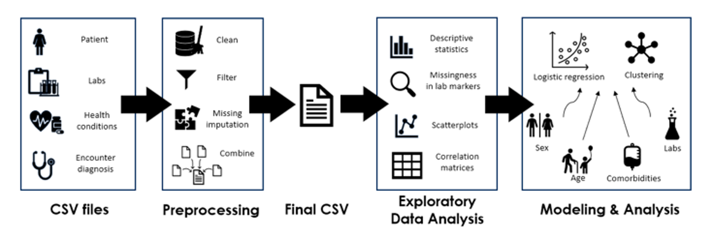

# CPCSSN-Group-Project

This repository contains all the data wrangling and analyses scripts for **examining the association between laboratory biomarkers and bipolar disorder diagnosis**. 

### Project Diagram

---

## Repository Structure

### `functions/`
Contains all scripts defining functions that are used in the Jupyter Notebooks, which includes data wrangling, preprocessing, exploratory data analysis (EDA), and modeling. Scripts are listed in order of use:

1. `wrangling.py`: Contains functions for loading, cleaning, filtering, and restructuring datasets.
2. `imputation.py`: Contains functions for loading a csv dataset, coding categorical variables, identifying columns with lab markers, dropping columns with 60% or more missing data, scaling auxiliary variables, applying KNN imputation, and saving a complete imputed dataset to csv.
3. `eda.py`: Contains functions for exploratory data analysis (EDA), including dataset summarization, visualizations (line, histogram, boxplot, correlation matrix, scatter, bubble, bar, pie, stacked area, table, polar, and lollipop charts), correlation analysis, and utility functions (check_unique_values) for data exploration.
4. `eda_model.py`: Contains functions for mapping and encoding variables, eda for a list of variables, and Kruskal-Walls Test.

### `notebooks/`
Contains the Jupyter Notebooks used to process and analyze the data.

`main.ipynb`: This is the primary notebook that performs the full pipeline: loading data, wrangling, preprocessing, imputation, EDA.

`analysis.ipynb`: This is the secondary notebook that performs the analytical procedures, including exploratory data analysis (EDA) to examine trends in laboratory markers over time, as well as statistical modeling.

### `supplementary/`
Contains the supplementary notebooks that explore or test additional wrangling, preprocessing, and modeling scenarios that are not in the `main.ipynb`. Notebooks are listed in order:
1. `data_wrangling.ipynb`: Focuses on cohort selection and lab filtering for bipolar disorder patients.
2. `imputation.ipnyb`: Focuses on visualizing missingness to confirm that the correct lab columns are being selected and imputed appropriately. Also contains visualizations of the distributions of lab markers using different imputation methods (comparing original distributions to imputed distributions with scaled vs unscaled auxiliary variables).
3. `eda_modelling.ipynb`: Focuses on eda of laboratory markers, testing their association with bipolar disorder subtypes, and applying statistical modeling to validate these associations.
---

## How to Use
1. Install Python 3.11.
2. Clone repository.
3. Import functions from `functions` folder, which contain reusable and generalizable code that can be applied to your dataset.
4. Load your files in the `main.ipynb`, then `analysis.ipynb`. Run the code, making modifications to functions or notebooks as needed.
5. Load in scripts from `supplementary/` for additional EDA and modeling.
